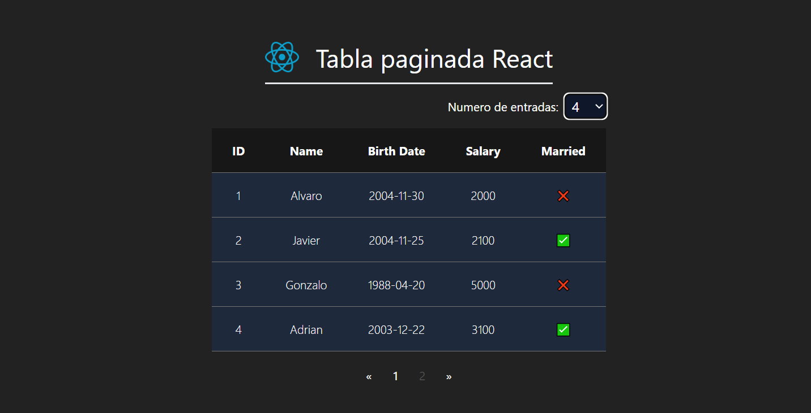
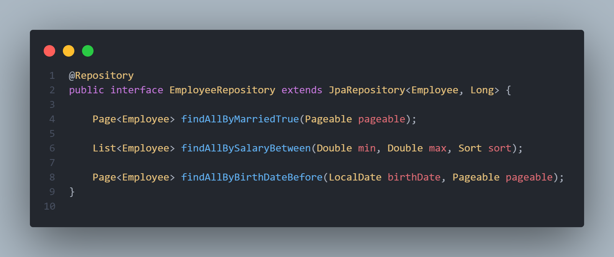
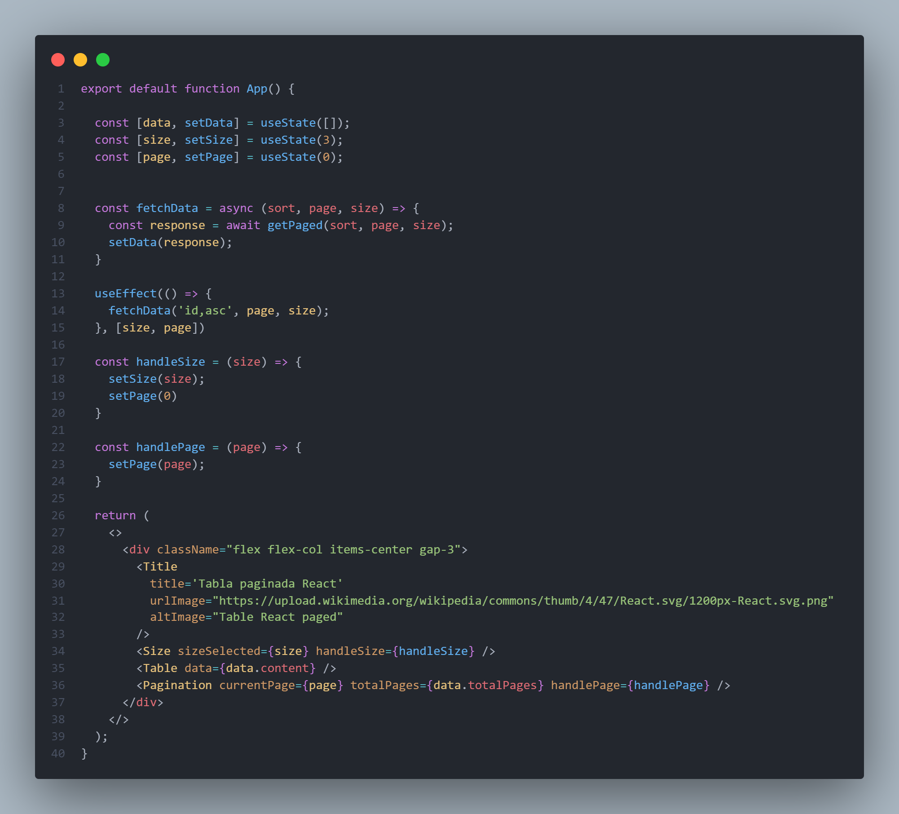

# Tabla Paginada | Spring Boot + React

Este es un mini proyecto donde aplico el acceso a datos con Spring Data JPA, para que me de resultados paginados y enviarselos al front.

Mientras tanto, React controla la api creando su propio servicio donde llama a la API REST.

(*VIDEO DEMO:* https://streamable.com/l3e8no)

## Desplegar el proyecto

* Para probar el proyecto deberás de tener los siguientes requerimientos:

    * Java v17 or higher
    * MVN 
    * NodeJS 

* Comando de despliegue en desarrollo:
    * En la aplicación front:
    `npm install` &&  `npm run dev`
    * En la aplicación backend:
    `mvn clean install` && `mvn spring-boot:run`

## Ilustraciones de codigo

### Clase repositorio del backend

### Componentes App.jsx frontend

